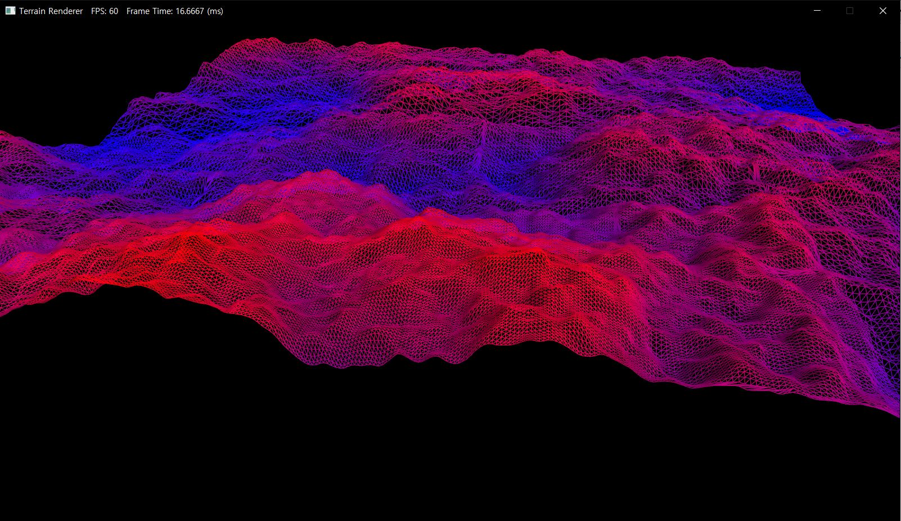

# Procedural-Terrain-Estimator
generate procedural terrains by specific data and algorithm (soon will be decided) and estimate them with tensorflow. with it's meta score, choose highest one and render it using OpenGL.

## ~~GLSLCACHE~~

~~this is **offline GLSL compiler**. in command line, just type below command.
compile given shader's paths and **provide compiled program binary output**.~~
OpenGL Shader is only available in opengl context where they created first.
thus, offline glsl compiler doesn't work at other program.

```

glslcache vert.glsl frag.glsl

//if you want to set output name, append -o option.
glslcache vert.glsl frag.glsl -o newname.glslcache

//if you use tessellation, just append -t option.
glslcache vert.glsl frag.glsl -t tcs.glsl tes.glsl -o newname.glslcache

//if you use geometry shader, just append -g option.
glslcache vert.glsl frag.glsl -t tcs.glsl tes.glsl -g gs.glsl -o newname.glslcache
```

## RENDERER
this is for **rendering procedural terrain**. default supported platform is Window. other platform like Linux, OS X will be supported later.



### Already Implemented
* Non-uniform patch with quad tree
* Tessellated terrain with height map
* Dynamic Level of Detal
* Splat map
* Terrain map
* Water rendering
* Water reflection & Skybox
* HDR Environment Map
* Lighting & Shading
* Tone mapping
* Fog
* Shadow mapping

### To be implemented
* Depth Of Field
* Screen Space Displacement Mapping
* Screen Space Ambient Occlusion
* Frustum Culling
* Cliff
* Decal volume
* Post-processing

## GENERATOR  

### Already Implemented
* Simplex-noise based height map generator
* GUI interface
* Voronoi function
 
### To be implemented
* Noise combination process
* Weight distribution 


## ESTIMATOR

### Already Implemented

* Vally / basin distinct function from gradient-descent method and flood fill
* Coast terrain generation by constant subtraction
* Island terrain generation by invert function

### To be implemented
* Terrain type distribution by height and near tiles condition
* Blend map generation
* etc...

## MEETING

매주 금요일 1시 콘텐츠랩 / 토요일 오전10시 온라인 개발
코드 검수 / 마일스톤 / 방향성 토의
