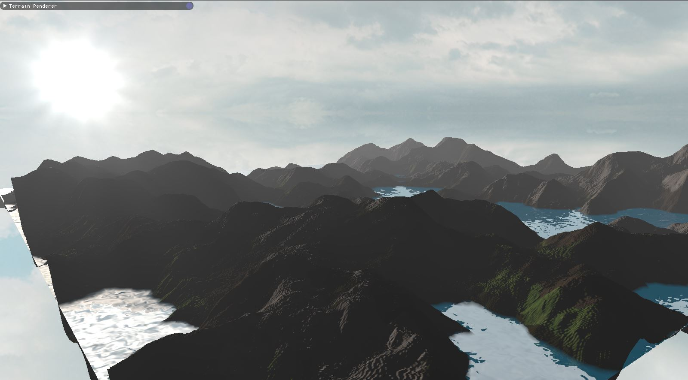
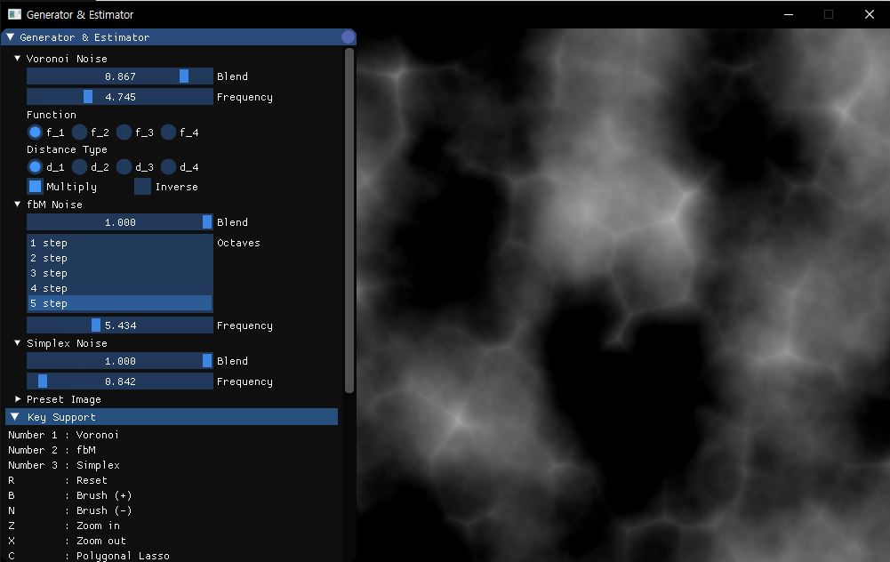
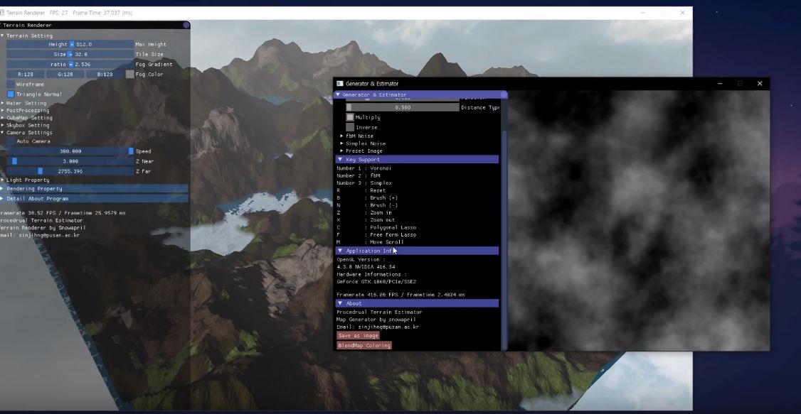

# Procedural Terrain Estimator
PTE consists of two programs, **Renderer and Editing tool**. 

###### The main usage of these programs is for generating 3D terrain by editing noise map and controlling several parameters of noise function. 

**Renderer** is mainly for viewing resources (height map, or equivalently, displacement map and blend map) which are generated by the Editing tool. Renderer always checks if resources have been modified, and ,if it does, reload resources in the OpenGL Current Context. This makes it easier for the users to edit resources and debug resources.

**Editing tool** consists of two stages, Generator and Estimator. 
At **Generator** stage, users can edit height map with several noise functions by controlling several parameters of each noise functions. Also enable to edit output board directly with additive brush / decline brush / lasso (free-form) / lasso (polygonal) / etc ..    
At **Estimator** stage, you can generate blend map associated with height map which you are editing.
This will be automatically done using several terrain related algorithms.

## Demo Video

## Features

1. **Renderer** :
	* Quad-tree based non-uniform patch primitive terrain
	* Dynamic Level Of Detail
	* Resource hot-reload technique (only for height map and blend map)
	* Sky box (rotation supported)
	* Water rendering (with reflection and refraction)
	* Fog (at terrain)
	* Shadow mapping
	* Gamma correction
	* Tone mapping
	* Motion Blur
	* Wireframe view (at geometry shader)
	* HDR Environment map (not included in release product)
	* Crepuscular Lighting (God-rays)
	
2. **Generator** :
	* several noise functions(voronoi, simplex, fbM) are supported
	* brush, lasso, move, zoom in/out tools
	* 16bit height map writing supported.
	* load preset images supported
	
3. **Estimator** :
	* Blend map generation with gradient descent and definite height.
	* Height map smoothness control.
	* Height map normalize.

## How to build
will be supported ...
## How to Use
#### Help
..
#### Keys
1. **Renderer** :
	* W,A,S,D - Camera movement
	* Cursor move - Camera rotation
	* ESC - quit program
	
2. **Editing Tool** :
	* 1, 2, 3 : Swap board for brushwork.
	* R : reset brush
	* B : Additive brush
	* N : Erase
	* Z : Zoom in
	* X : Zoom out
	* C : Lasso (polygonal)
	* F : Lasso (free-form)
	* M : move scroll

## Dependencies
* glfw3
* glad
* spdlog
* glm
* stb_image
* imgui
* opencv

## Tested Environment

| CPU  | GPU | OS    | it Work?  | Frame time |
|:-----:|:---:|:---------:|:------:|:------:|
| i7-7700HQ  | Nvidia Geforce GTX 1060 | Windows 64bit     | O | 8 (ms) |
| i5-? | HD630  | Windows 64bit      | O   | ? |

## Contributor
[**@snowapril**](https://github.com/Snowapril) - generator and renderer  
[**@kkorona**](https://github.com/kkorona) - estimator

## License
**MIT License**
