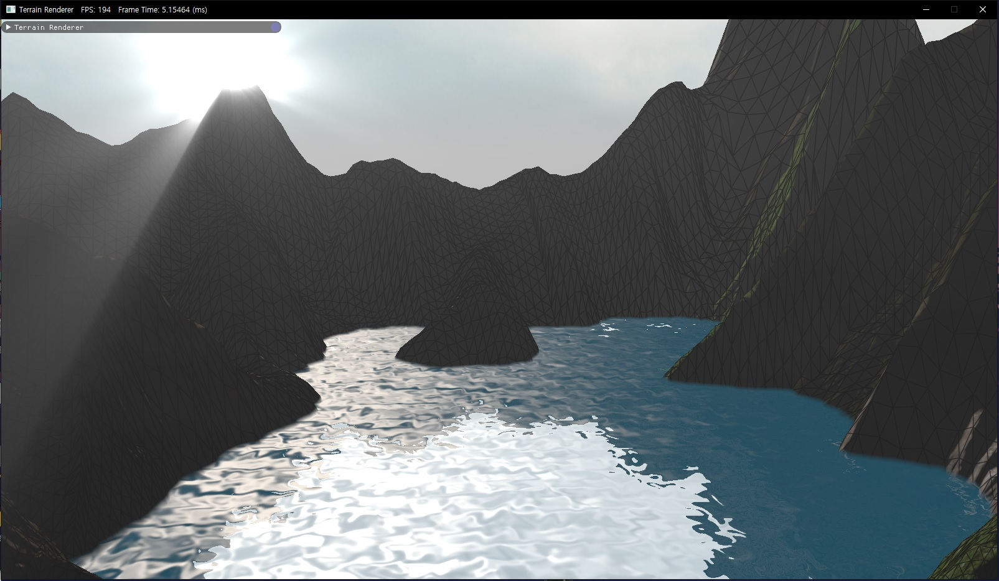

## RENDERER
this is for **rendering procedural terrain**. default supported platform is Window. other platform like Linux, OS X will be supported later.



### Already Implemented
* Non-uniform patch with quad tree
* Tessellated terrain with height map
* Dynamic Level of Detal
* Splat map
* Terrain map
* Water rendering
* Water reflection & Skybox
* HDR Environment Map
* Lighting & Shading
* Tone mapping
* Fog
* Shadow mapping
* Post-processing
* Volumetric Light Scattering
* Motion Blur

### To be implemented
* Depth Of Field
* Screen Space Displacement Mapping
* Screen Space Ambient Occlusion
* Frustum Culling
* Cliff
* Decal volume
